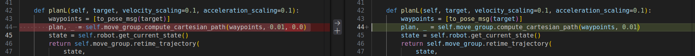
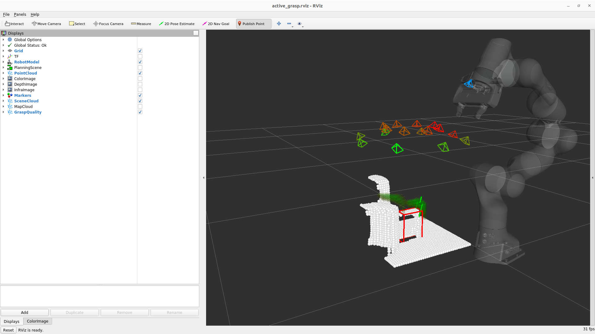

# Dockerized running of the existing package - [active_grasp](https://github.com/ethz-asl/active_grasp/tree/devel)


This repository contains a ros workspace and docker setup from the [active_grasp](https://github.com/ethz-asl/active_grasp/tree/devel) and [docker-env-blueprint](https://github.com/dipshikha-das/docker-env-blueprints.git) repositories with multiple dependent submodules already configured.

## Table of Contents

- [Repository Setup](#cloning-the-repositories)
  - [Active Grasp](#1-active_grasp-package-setup)
  - [Docker Env](#2-docker-env-blueprints-package-setup)
- [Running the packages](#running-the-packages)
- [Current Work]()


# Cloning the Repositories

## 1. active_grasp package setup
To clone the repository and update its submodules, use the following commands:

```bash
mkdir -p active_grasp_ws/src \
&& cd active_grasp_ws/src \
&& git clone https://github.com/dipshikha-das/ethz-asl-active_grasp.git \
&& git clone https://github.com/dipshikha-das/docker-env-blueprints.git
```

* For` ethz-asl-active_grasp` repository, the branches are pulled from the remote i.e., the branch tag defined in the `.gitmodules` file inside the repository. 

```bash
cd ethz-asl-active_grasp \
&& git checkout atu-arl-devel \
&& git submodule update --init --remote
```

### Download and extract URDFs and Models

* Following from the [vgn](https://github.com/ethz-asl/vgn/tree/devel) repositoty's README.md, copy [urdf](https://drive.google.com/file/d/1J_ImKqDoKEXs7ng4Yjolwyu5VnGugjoZ/view) and [pretrained models](https://drive.google.com/file/d/1J3cPjyVQ59LpcLZZrA7EfeV3xTmITchr/view) into the **assets** folder of the vgn package.

* Following from the [active-grasp](https://github.com/ethz-asl/active_grasp/tree/devel) repository's README.md, extract the [assets folder](https://drive.google.com/file/d/1xJF9Cd82ybCH3nCdXtQRktTr4swDcNFD/view) inside the package.

Folder structure after executing the above should be as follows:

```shell
active_grasp_ws/
├── src/
│   ├── active_grasp/
│   │   ├── assets/
│   │   │   ├── box/ .. ycb/
│   │   ... #Other folders
│   ├── vgn/
│   │   ├── assets/
│   │   │   ├── urdfs/
│   │   │   ├── models/
│   │   ... #Other folders
│   ... #Other packages
```

### Update files

> [!IMPORTANT]
> Currently for the package to work, 1 file requires a minimal change since there have recent changes in the code's source.

* Update the **`moveit.py`** file inside the package `/robot_helpers/robot_helpers/ros/` and update the following line:



> [!WARNING]
> **Issue**: The C++ function definition for [noetic-devel](https://github.com/moveit/moveit/commit/9caa14eabc69c6ba2328eacfb5f6253a8acff085) has been updated recently and the new definition does not require an additional parameter. Remove the last parameter, thus keeping the default from definition.

## 2. docker-env-blueprints package setup

```bash
cd docker-env-blueprints
```

### Update files 

> [!IMPORTANT]
> Follow the docker-env-blueprints's [README.md](https://github.com/dipshikha-das/docker-env-blueprints/tree/ros-any#) to update required files.

* Specific changes required in `.env` for the active grasp repository
    * Update the `IMAGE_NAME`, `CONTAINER_NAME`, `HOST_IP_ADD`, `HOST_HOME`, `LOCAL_WORKSPACE` and `APT_PACKAGES` accordingly in the `.env` file.
    * For **`export APT_PACKAGES`**, copy and add the following dependencies
```
ros-noetic-moveit ros-noetic-ros-controllers ros-noetic-gazebo-ros-control ros-noetic-rosserial ros-noetic-rosserial-arduino ros-noetic-roboticsgroup-upatras-gazebo-plugins ros-noetic-actionlib-tools ros-noetic-franka-description ros-noetic-franka-control ros-noetic-kdl-parser-py ros-noetic-rviz ros-noetic-rviz-visual-tools python3 python3-pip python3-colcon-common-extensions python3-catkin-tools build-essential python3-rosdep python3.8-venv libboost-all-dev libnlopt-dev libnlopt-cxx-dev swig mlocate
```
* In **`requirements.txt`**, copy and paste the following into the file:

```bash
catkin_pkg
black
rosnumpy
jupyterlab==3.*
numpy==1.23.2
scipy>=1.5.0
pandas==2.0.3
matplotlib
mpi4py
open3d==0.13.0
torch
pytorch-ignite
tensorboard
tqdm
numba
pybullet==2.7.9
trimesh
python-dateutil>=2.8.2
setuptools>=60.2.0
scikit-learn==1.3.2
jupyter-client==7.4.9
pyyaml>=5.4.1
scikit-image
testresources==2.0.1
importlib_metadata==8.5.0
```
* These have been collected from the respective `requirements.txt` file present inside the different packages(active_grasp, vgn) and updated based on any version dependencies that occured during installation.

### Docker build and run

* Once the setup is completed, execute and build the docker as per instructions outlined in the **docker-env-blueprints** [README.md](https://github.com/dipshikha-das/docker-env-blueprints/tree/ros-any)

## Running the packages

* After docker build is completed, source the workspace and execute the commands from the **active_grasp** [README.md](https://github.com/ethz-asl/active_grasp/tree/devel) inside the docker.

The following should be the visible outputs for the simulation commands:




## Onging work
- [x] Simulation setup
- [ ] Configurure and run on hardware

